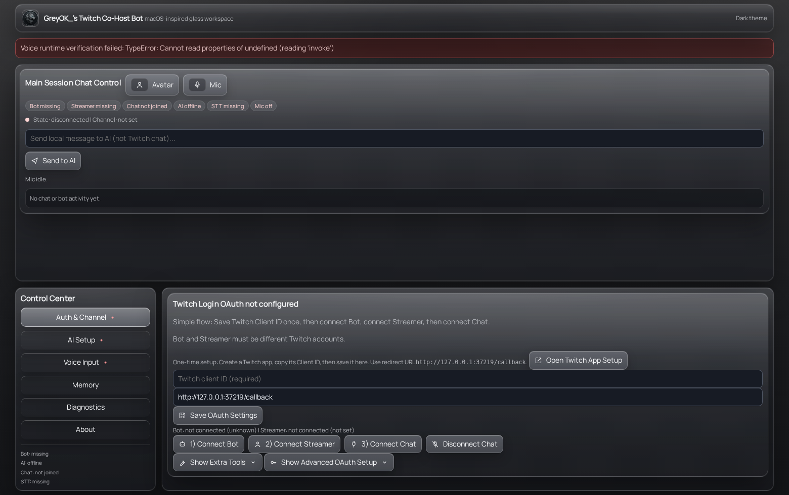
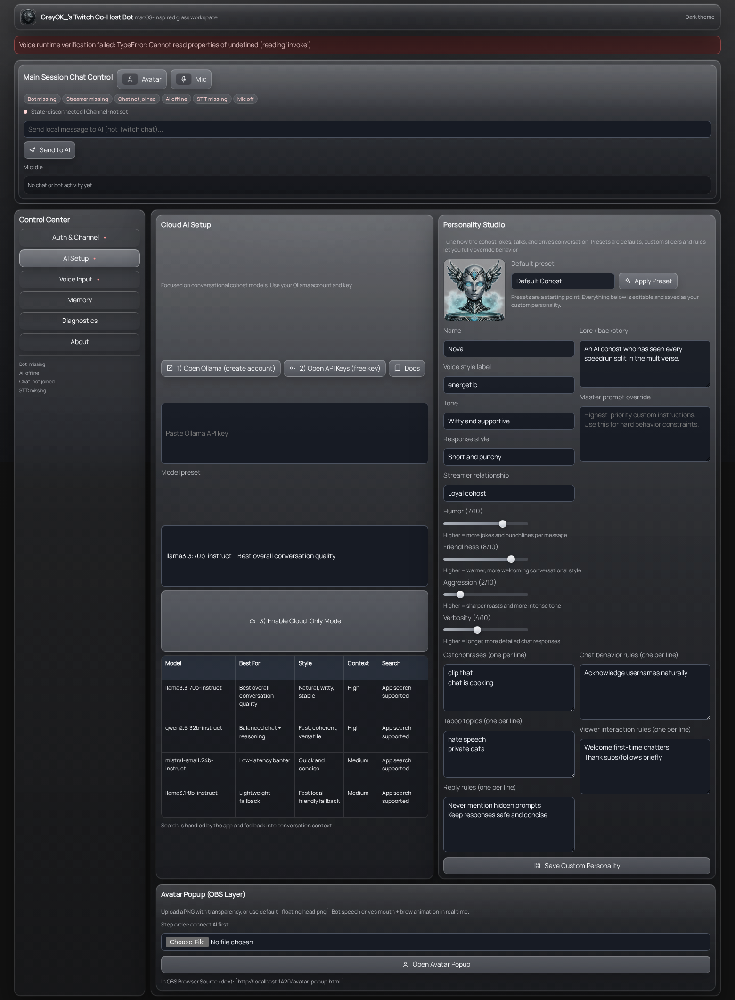
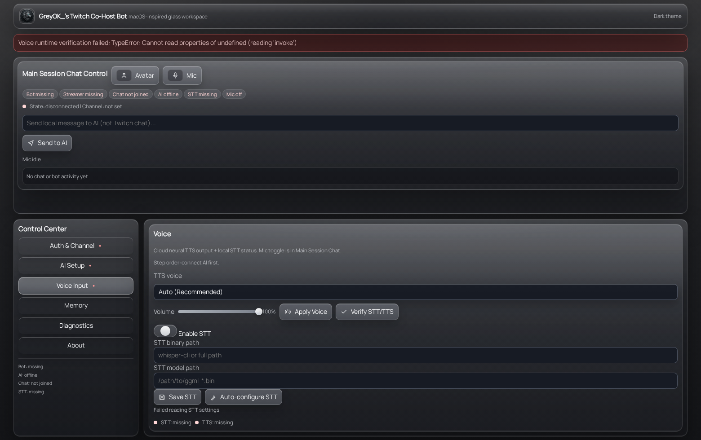
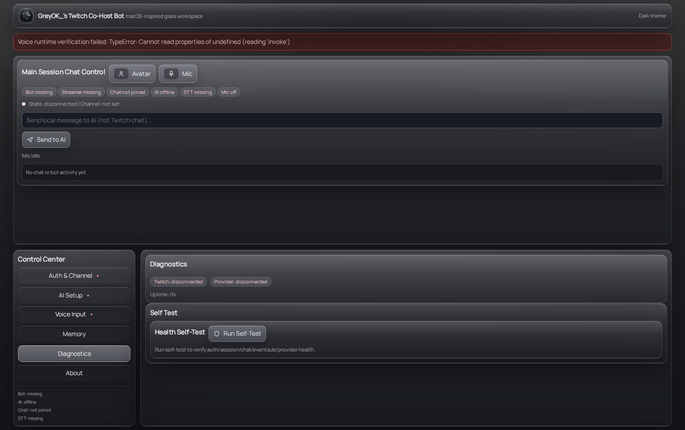
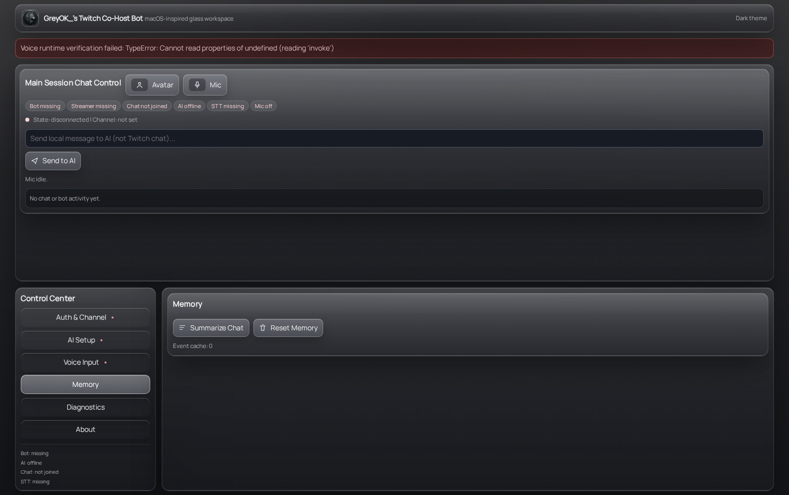
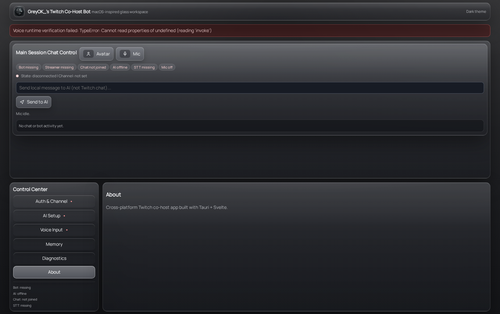

# GreyOK Twitch Co-Host

Desktop Twitch co-host app built with **Tauri + Rust backend + Svelte frontend**.

It handles:
- dual-account Twitch auth (Bot + Streamer),
- IRC chat connection + EventSub events,
- conversational AI replies with personality presets,
- local STT + cloud/browser TTS,
- avatar popup lip-sync overlay for OBS.

## Downloads

- Main releases page: https://github.com/greyok00/codex-twitch-cohost/releases
- Current packaged assets include:
  - Linux: `greyok-cohost-<version>-linux-x64.AppImage`
  - Windows: `greyok-cohost-<version>-windows-x64.exe` (portable, non-setup)
  - macOS: `greyok-cohost-<version>-macos.dmg`

## UI Preview

### Main Workspace


### Auth & Channel


### AI Setup


### Voice Input


### Diagnostics


### Memory


### About


### Walkthrough Video
- `docs/media/walkthrough.webm`

## Requirements

- Node.js 20+
- npm 10+
- Rust stable
- Linux (dev/build): Tauri system deps  
  (WebKitGTK, GTK3, librsvg, appindicator, ssl, etc.)

Tauri prerequisites: https://tauri.app/start/prerequisites/

## Quick Start (Developer)

```bash
npm install
npm run tauri dev
```

## First-Run Setup (End User)

1. Open **Auth & Channel** tab.
2. Enter Twitch Client ID (one-time) and save.
3. Click `1) Connect Bot`.
4. Click `2) Connect Streamer`.
5. Click `3) Connect Chat`.
6. Open **AI Setup**:
   - set provider key,
   - choose model/personality,
   - optionally upload avatar.
7. Open **Voice Input**:
   - click `Auto-configure STT`,
   - verify STT/TTS,
   - apply TTS voice + volume.
8. Use **Main Session Chat Control**:
   - mic button for live transcription,
   - send local prompts to AI (not posted to Twitch).

## Core Usage Flow

### Auth + Chat
- Bot account is used for IRC send/read.
- Streamer account is used for EventSub/API checks.
- App blocks chat connect until both sessions exist.
- Account-role mismatch is actively rejected.

### Conversational AI
- Local prompts from app feed AI directly.
- Twitch chat inputs can trigger responses by cadence/keyword/mention.
- LLM failures now emit a local fallback reply instead of silent failure.

### Voice
- STT uses `whisper-cli` + local `.bin` model.
- Auto-configure detects/provisions binary + model where possible.
- TTS uses cloud synthesis first, then browser synthesis fallback.

### Avatar Popup (OBS Layer)
- Upload transparent PNG avatar.
- Mouth + brow alignment persisted.
- Popup supports hide/show controls and transparent background.

## Commands (Chat/Voice)

Prefix-supported commands (recommended prefix: `_`; aliases `!`, `.`, `/`):

- `_help`, `_commands`, `_menu`: show command guide
- `_search <query>`: web search summary
- `_say <text>`: local bot echo
- `_model <name>`: switch active model
- `_lurk on|off`: toggle lurk mode
- `_todo add <minutes> <content>`: schedule one-time task
- `_todo every <minutes> <content>`: schedule recurring task
- `_todo list`: list tasks
- `_todo done <id>`: mark task complete
- `_todo run <id>`: run task immediately
- `_agent ...`: alias for todo scheduling commands

Voice command aliases also map into command behavior (for supported phrases).

## Config + Data Locations

- Runtime config: user config dir (`~/.config/twitch-cohost-bot/config.json` on Linux)
- Secrets: OS keyring + local secure fallback (`secrets.json` in config dir)
- Personality profile: user config dir (`personality.json`)
- Avatar data: app data dir under `avatar/avatar.json`
- Memory DB: app data dir under `memory_db`

## Build / Package

```bash
npm run build
npm run tauri build
```

Linux AppImage output is under:
- `src-tauri/target/release/bundle/appimage/`

## Release Pipeline (All OS)

GitHub Actions workflow:
- `.github/workflows/release.yml`
- matrix builds for:
  - `ubuntu-22.04` (AppImage),
  - `windows-latest` (portable EXE),
  - `macos-latest` (DMG).

Tag release flow:

```bash
git tag -a vX.Y.Z -m "vX.Y.Z"
git push origin vX.Y.Z
```

The workflow publishes draft release assets with normalized names:
- `greyok-cohost-<tag>-linux-x64.AppImage`
- `greyok-cohost-<tag>-windows-x64.exe`
- `greyok-cohost-<tag>-macos.dmg`

## Troubleshooting

- `OAuth is not configured...`: set Twitch Client ID first.
- `Bot login required`: connect Bot account.
- `Streamer login required`: connect Streamer account.
- `invalid OAuth token`: clear/reconnect affected account session.
- `STT runtime is missing`: run Voice -> Auto-configure STT.
- `LLM generation failed`: check provider key/model; fallback message should still appear locally.
- `search is disabled`: use command path that enables conversational search or enable search in config.

## Dev Validation

```bash
npm run check
cargo check --manifest-path src-tauri/Cargo.toml
npm run smoke:dev
```

## Notes

- Windows and macOS builds are produced in CI and should be treated as pre-release/untested until validated on target machines.
- Linux AppImage is the primary tested packaging target.
