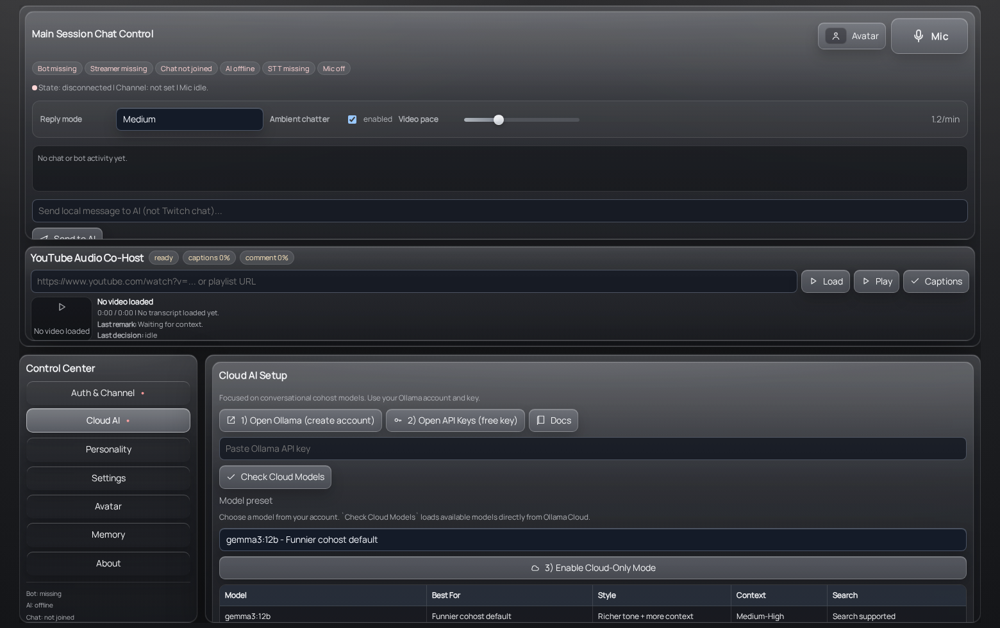
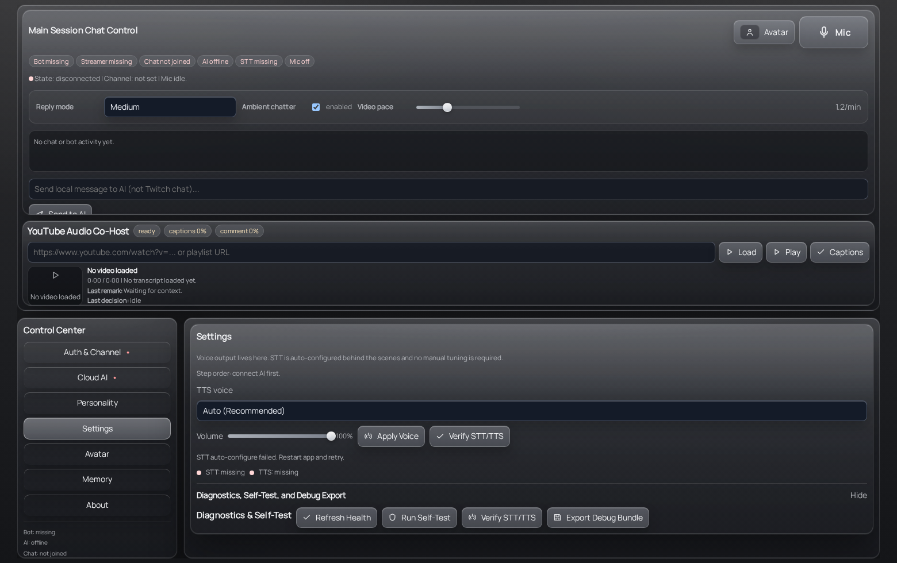
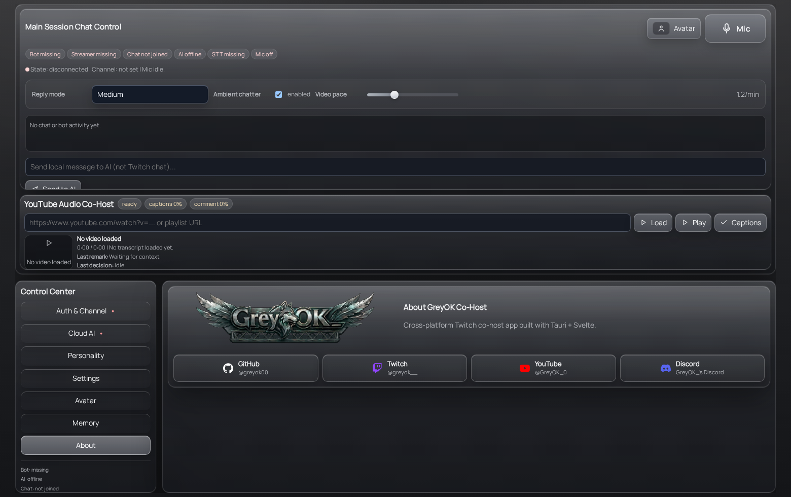

<p align="center">
  
</p>

<h1 align="center">GreyOK Twitch Co-Host</h1>

<p align="center">
  Desktop Twitch co-host built with Tauri, Rust, and Svelte.
</p>

## Downloads

- Releases: https://github.com/greyok00/codex-twitch-cohost/releases
- Linux: `greyok-cohost-<version>-linux-x64.AppImage`
- Windows: `greyok-cohost-<version>-windows-x64.exe`
- macOS: `greyok-cohost-<version>-macos.dmg`

## What This App Does

GreyOK Twitch Co-Host is a desktop app for running a conversational AI co-host during a stream.

It can:
- connect separate Twitch `Bot` and `Streamer` accounts
- join chat and monitor stream activity
- listen locally with STT
- speak back with TTS
- keep a local co-host chat log in the app
- run a floating avatar window for OBS-style overlays
- run a YouTube co-host mode that watches a video, tracks transcript context, and makes short remarks
- verify core services with built-in diagnostics and self-tests

## Screenshots

### Main Session


### Auth And Channel


### Cloud AI Setup



### Settings And Diagnostics



### About



## Quick Start

### 1. Install and run

Linux:

```bash
chmod +x greyok-cohost-<version>-linux-x64.AppImage
./greyok-cohost-<version>-linux-x64.AppImage
```

Or run from source:

```bash
npm install
npm run tauri dev
```

### 2. Set up Twitch

Open `Auth & Channel`.

Fill in:
- Twitch Client ID
- Bot username
- Streamer login

Then do the login flow in this order:
1. Connect Bot
2. Connect Streamer
3. Connect Chat

Important:
- Bot and Streamer must be different Twitch accounts.
- The channel should follow the Streamer account.

### 3. Set up the AI model

Open `Cloud AI`.

Do this:
1. Open `Ollama`
2. Create an account if needed
3. Create an API key
4. Paste the key into the app
5. Click `Check Cloud Models`
6. Pick a model
7. Click `Enable Cloud-Only Mode`

Recommended presets:
- `qwen3:8b` for faster conversation
- `gemma3:12b` for better context and humor
- `phi4:14b` for longer-context behavior

### 4. Set up voice

Open `Settings`.

The app will try to auto-configure STT on startup.

Then:
1. Choose a TTS voice
2. Set the volume
3. Click `Apply Voice`
4. Click `Verify STT/TTS`

If verification is green, the voice pipeline is ready.

## How To Use It

## Main Chat

The top chat area is the local co-host console.

Use it to:
- speak to the AI with the mic button
- send a local typed message to the AI
- watch status chips for Bot, Streamer, Chat, AI, STT, and Mic
- control how often the co-host makes autonomous comments
- switch between reply modes

Reply modes:
- `Fast conversational`: quickest responses
- `Medium`: better balance
- `Long context`: slower but more contextual

`Ambient chatter` controls whether the AI only responds when prompted or also comments on its own.

## YouTube Co-Host Mode

The YouTube panel sits directly under the chat.

Paste a YouTube URL and click `Load`.

The app will:
- load the video through the YouTube IFrame Player API
- fetch transcript context when available
- score whether there is enough context to interrupt
- pause at a natural break
- generate a short context-relevant remark
- speak the remark
- resume playback

Supported transcript sources:
- provider captions
- uploaded transcript or subtitle file
- metadata fallback when captions are missing

## Avatar

Open `Avatar` from the Control Center.

You can:
- upload a head image
- open the floating avatar window
- adjust mouth and eyebrow rig placement
- use the avatar as an OBS overlay layer

## Settings And Diagnostics

Diagnostics are tucked inside `Settings`.

Available tools:
- `Verify STT/TTS`
- `Refresh Health`
- `Run Self-Test`
- `Export Debug Bundle`

The health view separates:
- configured
- available
- authenticated
- active

That makes it much easier to tell whether something is merely unset, missing on disk, not logged in, or actually failing live.

## Simple Troubleshooting

### The AI is not replying

Check:
1. `Cloud AI` has a valid Ollama key
2. a real model is selected
3. `AI` status is online
4. `Chat` is connected if you expect Twitch replies

### The mic is not hearing you

Open `Settings` and run `Verify STT/TTS`.

If STT is not ready:
- restart the app once
- let auto-configure run
- verify the bundled whisper runtime exists

### The bot connects with the wrong Twitch account

Clear sessions, then reconnect in the correct order:
1. Bot
2. Streamer
3. Chat

The bot and streamer accounts must stay separate.

### YouTube mode is not making comments

Check:
1. the video has captions, or upload a transcript file
2. `Ambient chatter` is enabled
3. `Video pace` is above zero
4. the selected model is valid

## Social Links

- GitHub: https://github.com/greyok00
- Twitch: https://twitch.tv/greyok__
- YouTube: https://www.youtube.com/@GreyOK_0
- Discord: https://discord.gg/TJcr6ZxJ

## Development

```bash
npm install
npm run lint
npm run test:harness
cargo test --manifest-path src-tauri/Cargo.toml
npm run build
```

Run the app:

```bash
npm run tauri dev
```

## Packaging

Local build:

```bash
npm run build
npm run tauri build
```

Cross-platform releases are built by GitHub Actions on tag push:
- Ubuntu builds the AppImage
- Windows builds the portable EXE
- macOS builds the DMG

## Notes

- The app is optimized around a live conversational co-host flow, not a command-heavy bot UI.
- Web search support exists in the codebase, but it is not the primary workflow yet.
- The release page is the source of truth for packaged builds.
