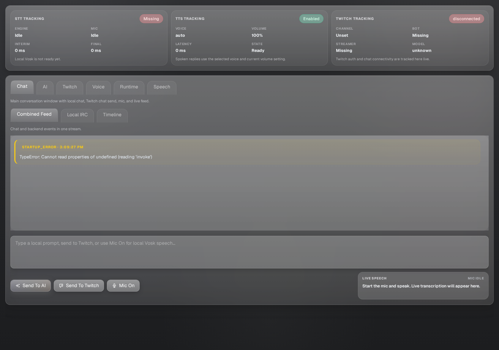

<p align="center">
  
</p>

# GreyOK CoHost

AI Twitch co-host desktop app built with Tauri, Rust, and React.

## Downloads

- Releases: https://github.com/greyok00/codex-twitch-cohost/releases
- Linux: `greyok-cohost-<version>-linux-x64.AppImage`
- Windows: `greyok-cohost-<version>-windows-x64.exe`
- macOS: `greyok-cohost-<version>-macos.dmg`

Windows and macOS builds are published, but they are still less tested than the Linux workflow.

## Overview

GreyOK CoHost is a local-first Twitch companion that combines:

- live local chat and timeline feeds
- Twitch bot + streamer OAuth and IRC chat connection
- EventSub reactions in the runtime timeline
- Ollama Cloud model selection
- AssemblyAI live STT with local Vosk fallback
- neural TTS voice playback
- memory banks for persistent setup and streamer context
- runtime controls for auto comments, reply size, posting, and pacing

The current app is focused on voice-first co-hosting. The older 2D avatar rigging path is removed from the active UI while a better hybrid 3D/2D system is researched.

## Current UI

The app uses a neutral grey glass desktop shell with a pinned diagnostics strip across the top.

Top diagnostics:

- `STT Tracking`
- `TTS Tracking`
- `Twitch Tracking`

Main tabs:

- `Chat`
- `AI`
- `Twitch`
- `Voice`
- `Runtime`
- `Speech`

## Quick Start

### Run From Source

```bash
npm install
npm run tauri dev
```

### Validate

```bash
npm run build
cargo check --manifest-path src-tauri/Cargo.toml
```

### Run A Release Build

Linux AppImage:

```bash
chmod +x greyok-cohost-<version>-linux-x64.AppImage
./greyok-cohost-<version>-linux-x64.AppImage
```

## First Setup

### 1. AI

Open `AI`.

1. Paste your Ollama API key.
2. Click `Open Ollama` if you need an account.
3. Click `Open API Keys` to generate or copy your key.
4. Click `Check Cloud Models`.
5. Pick a model from the curated list.
6. Click `Use Selected Model`.

The app keeps conversational and uncensored model picks separate and surfaces the current model in the top diagnostics strip.

### 2. Twitch

Open `Twitch`.

1. Save your Twitch app `Client ID`.
2. Keep the default redirect URL unless you have a reason to change it:
   `http://127.0.0.1:37219/callback`
3. Connect in this order:
   - `Connect Bot`
   - `Connect Streamer`
   - `Connect Chat`

Use separate Twitch accounts for the bot and the streamer.

When chat connects successfully, the timeline will explicitly report whether the EventSub listener started.

### 3. Voice

Open `Voice`.

1. Select a voice.
2. Click `Play Sample`.
3. Click `Save Voice`.
4. Pick a `Delivery mode`.
5. Optional: enable `Allow profanity`.
6. Optional: add `Extra direction`.

Current curated voices:

- Emma
- Jenny
- Aria
- Guy
- Roger

### 4. Speech

Open `Speech`.

1. Paste your AssemblyAI API key.
2. Click `Open AssemblyAI` if you need an account.
3. Click `Open API Keys`.
4. Click `Save AssemblyAI Key`.
5. Use `Repair Local Vosk` only if local fallback needs repair.
6. Use `Run Mic Debug` if STT says it is listening but no transcript arrives.

AssemblyAI live STT is the primary path. Local Vosk remains available as fallback and repair path.

## Walkthrough

### Chat

`Chat` is the main conversation surface.

- `Combined Feed` merges chat and runtime events.
- `Local IRC` shows chat messages only.
- `Timeline` shows runtime and backend events only.
- `Send To AI` submits a local prompt.
- `Send To Twitch` sends directly to Twitch chat.
- `Mic On` starts live speech capture.
- `Live Speech` shows the current or last heard transcript in one visible box.

### AI

`AI` is model setup only.

- Ollama API key field
- curated cloud model list
- account model discovery
- one-click model activation

### Twitch

`Twitch` controls auth and channel connection.

- Twitch OAuth settings
- Bot connect/disconnect
- Streamer connect/disconnect
- Chat connect/disconnect
- full auth reset

### Voice

`Voice` controls how the co-host sounds and behaves.

- curated voice selection
- sample playback
- save/apply flow
- delivery presets
- profanity toggle
- extra direction prompt field

### Runtime

`Runtime` controls behavior.

- `Voice replies`
- `Keep talking`
- `Bot posting to Twitch`
- `Auto comments`
- `Brief reactions`
- `Reply size`
- `Chattiness`
- `Voice volume`

### Speech

`Speech` contains speech setup and recovery tools.

- AssemblyAI key setup
- local Vosk repair
- Mic Debug
- memory bank reset/open tools

## Runtime Notes

- `Bot posting to Twitch` controls whether normal bot replies are posted into Twitch chat.
- EventSub startup and failure now emit explicit timeline messages.
- STT errors and transcript drops are logged in the normal timeline feed for easier debugging.
- Spoken TTS replies are intentionally shorter than the full chat reply to reduce perceived latency.

## Development

Install dependencies:

```bash
npm install
```

Run the desktop app:

```bash
npm run tauri dev
```

Validate:

```bash
npm run build
cargo check --manifest-path src-tauri/Cargo.toml
```

Refresh the README screenshot:

```bash
node scripts/docs_capture.mjs
```

The capture script checks these local URLs in order:

- `http://127.0.0.1:1420/`
- `http://127.0.0.1:4180/`
- `http://127.0.0.1:5173/`

## Roadmap

### Near Term

- reduce TTS latency further
- harden barge-in and mixed-turn transcript recovery
- improve EventSub reaction coverage
- stabilize long open-mic sessions

### Conversational Quality

- keep shaping replies around short human turn sizes
- expand repair moves and brief reactions using the quantitative conversation research
- reduce repetition in long sessions
- keep interruptions feeling normal instead of brittle

### Avatar / Visual Layer

- replace the removed 2D rigging path with a more realistic hybrid avatar system
- explore embedded Three.js face-shell rendering with a 2D portrait texture or mask
- keep Live2D / VRM options open for a later full visual pass

## Research Notes

Saved reference docs:

- `docs/research/conversation-quantitative-notes.md`
- `docs/research/avatar-3d-2d-hybrid-options.md`

## Social Links

- GitHub: https://github.com/greyok00
- Twitch: https://twitch.tv/greyok__
- YouTube: https://www.youtube.com/@GreyOK_0
