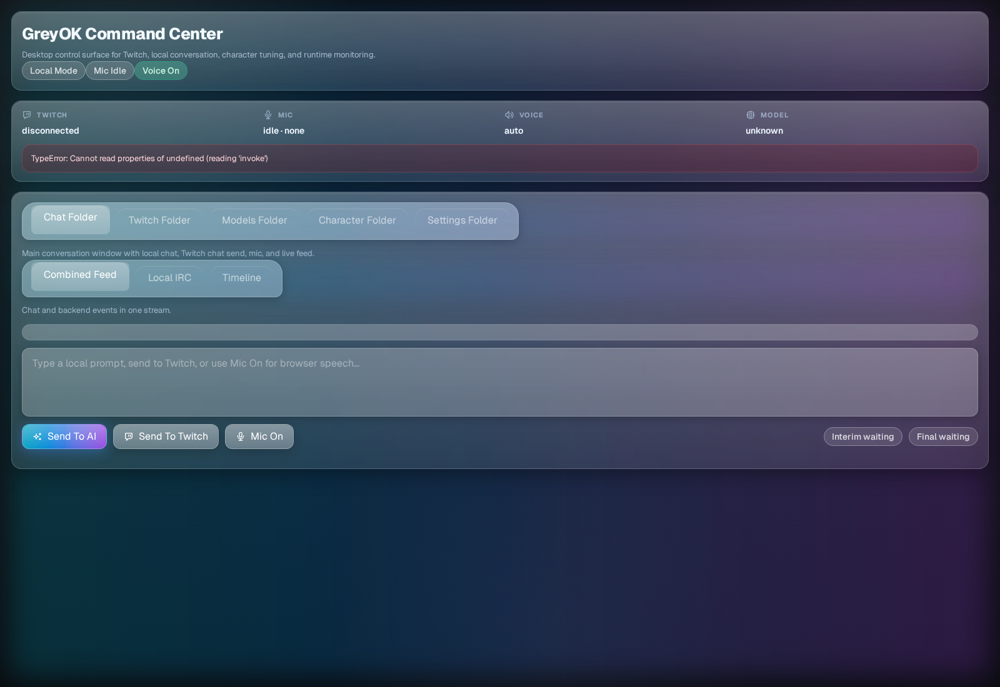

<p align="center">
  
</p>

# GreyOK Twitch Co-Host

Desktop Twitch co-host built with Tauri, Rust, React, and a browser-safe voice/chat fallback for local testing.

## Downloads

- Releases: https://github.com/greyok00/codex-twitch-cohost/releases
- Linux: `greyok-cohost-<version>-linux-x64.AppImage`
- Windows: `greyok-cohost-<version>-windows-x64.exe`
- macOS: `greyok-cohost-<version>-macos.dmg`

## Overview

GreyOK Twitch Co-Host is a desktop command center for:

- local chat and mic-driven cohost sessions
- Twitch OAuth, bot auth, streamer auth, and chat connection
- curated Ollama cloud model selection
- character presets, voice pairing, and avatar rig tuning
- runtime controls for pacing, voice replies, and diagnostics
- a floating avatar popup for stream overlays

## Quick Startup

### Run A Release Build

Linux AppImage:

```bash
chmod +x greyok-cohost-<version>-linux-x64.AppImage
./greyok-cohost-<version>-linux-x64.AppImage
```

### Run From Source

```bash
npm install
npm run tauri dev
```

### First 5 Minutes

1. Open `Models Folder`.
2. Paste your Ollama API key.
3. Click `Check Cloud Models`.
4. Pick a curated model.
5. Click `Enable Cloud-Only Mode`.
6. Return to `Chat Folder` and send a prompt or click `Mic On`.

### Optional Twitch Setup

Open `Twitch Folder` and save your Twitch app details first.

- Redirect URL default: `http://127.0.0.1:37219/callback`
- Connect in this order: `Connect Bot`, `Connect Streamer`, `Connect Chat`
- Keep Bot and Streamer on separate Twitch accounts

### Optional Character And Voice Setup

- `Character Folder` lets you pick a preset, tune warmth/humor/flirt/edge/energy/story, and rig the avatar stage.
- `Settings Folder` lets you toggle voice replies, keep-talking mode, bot posting, auto comments, volume, and runtime diagnostics.

## Main Folders

### Chat Folder

- combined feed, local IRC feed, and timeline feed
- `Send To AI`, `Send To Twitch`, and `Mic On`
- live interim and final speech status badges

### Twitch Folder

- Twitch Client ID and redirect URL
- bot and streamer OAuth flows
- direct chat connect/disconnect controls

### Models Folder

- short curated model catalog
- conversational and uncensored picks
- cloud-only enable flow without dumping the full provider catalog

### Character Folder

- preset-driven personality selection
- explicit voice pairing
- embedded avatar stage with popup support

### Settings Folder

- voice replies, keep talking, bot posting, and auto comments
- chat pacing and voice volume sliders
- voice runtime diagnostics in the main control surface

## Development

Install dependencies:

```bash
npm install
```

Run the desktop app:

```bash
npm run tauri dev
```

Verify the frontend and Rust backend:

```bash
npm run lint
npm run build
cargo test --manifest-path src-tauri/Cargo.toml
```

Refresh the single README screenshot against a running local frontend:

```bash
npm run docs:capture
```

The capture script reads `DOCS_CAPTURE_URL` when you want to target a non-default local URL.

## Release Workflow

- Version is currently `0.3.0`.
- GitHub Actions builds release artifacts on `v*` tags.
- Tagging `v0.3.0` publishes draft releases for Linux, Windows, and macOS.

## Social Links

- GitHub: https://github.com/greyok00
- Twitch: https://twitch.tv/greyok__
- YouTube: https://www.youtube.com/@GreyOK_0
